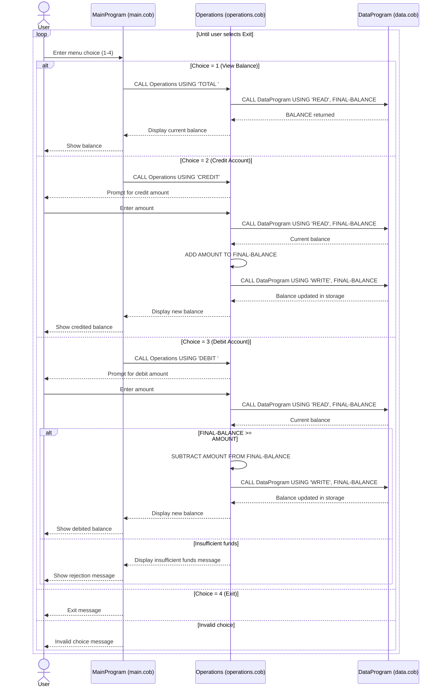

# Student Account COBOL Documentation

This document explains the purpose of each COBOL file in this project, the key functions implemented, and the business rules that govern student account behavior.

## Overview

The application is a menu-driven account management system for a single student account balance. It is split into three COBOL programs:

- `main.cob`: User interface and menu control loop.
- `operations.cob`: Business operations (view, credit, debit).
- `data.cob`: In-memory data access layer for reading/writing balance.

Call flow:

1. `MainProgram` accepts a menu choice.
2. `MainProgram` calls `Operations` with an operation code (`TOTAL `, `CREDIT`, or `DEBIT `).
3. `Operations` reads and/or writes the balance via `DataProgram`.

## File-by-File Purpose

### src/cobol/main.cob (`MainProgram`)

Purpose:

- Displays the account management menu.
- Collects user choice.
- Routes the request to `Operations`.
- Keeps running until the user exits.

Key logic:

- Uses `PERFORM UNTIL CONTINUE-FLAG = 'NO'` for the main loop.
- Uses `EVALUATE USER-CHOICE` to dispatch:
  - `1` -> view balance (`TOTAL `)
  - `2` -> credit account (`CREDIT`)
  - `3` -> debit account (`DEBIT `)
  - `4` -> exit
- Handles invalid menu choices with a message.

### src/cobol/operations.cob (`Operations`)

Purpose:

- Implements account operation workflows.
- Coordinates with `DataProgram` to retrieve/update persistent balance state (within runtime).

Key functions:

- `TOTAL ` operation:
  - Calls `DataProgram` with `READ`.
  - Displays current balance.

- `CREDIT` operation:
  - Accepts credit amount from user.
  - Reads current balance.
  - Adds amount.
  - Writes updated balance.
  - Displays new balance.

- `DEBIT ` operation:
  - Accepts debit amount from user.
  - Reads current balance.
  - Verifies available funds.
  - Subtracts amount and writes new balance if funds are sufficient.
  - Rejects transaction if funds are insufficient.

### src/cobol/data.cob (`DataProgram`)

Purpose:

- Serves as a simple data service for the account balance.
- Encapsulates balance storage and exposes two actions: read and write.

Key functions:

- `READ`:
  - Moves internal `STORAGE-BALANCE` to linked `BALANCE`.

- `WRITE`:
  - Moves linked `BALANCE` into internal `STORAGE-BALANCE`.

Data notes:

- Balance format is `PIC 9(6)V99` (up to six integer digits plus two decimals).
- Initial balance is `1000.00`.
- Balance is held in working storage for program runtime; there is no file/database persistence.

## Student Account Business Rules

The current code enforces the following business rules for student accounts:

1. Single active account context:
   - The system manages one balance value at a time in memory.

2. Starting balance:
   - Student account starts at `1000.00` when program runtime begins.

3. Allowed operations:
   - View current balance, credit funds, debit funds, and exit.

4. No overdraft allowed:
   - Debit is only applied when `FINAL-BALANCE >= AMOUNT`.
   - Otherwise, transaction is rejected with an "Insufficient funds" message.

5. Immediate update after successful transaction:
   - Credit/debit operations write the updated balance through `DataProgram` immediately.

6. Runtime-only persistence:
   - Balance state persists only while programs remain loaded during execution flow.
   - There is no external storage for long-term student account history.

## Current Limitations Relevant to Business Policy

These are important when interpreting student account behavior:

- No validation prevents negative or zero input amounts.
- No student identifier is captured; account is not tied to a specific student record.
- No transaction audit trail (date/time, operation history).
- No concurrency control for multiple users/sessions.

## Sequence Diagram (Data Flow)

